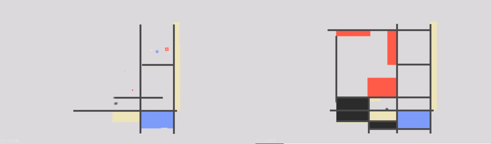
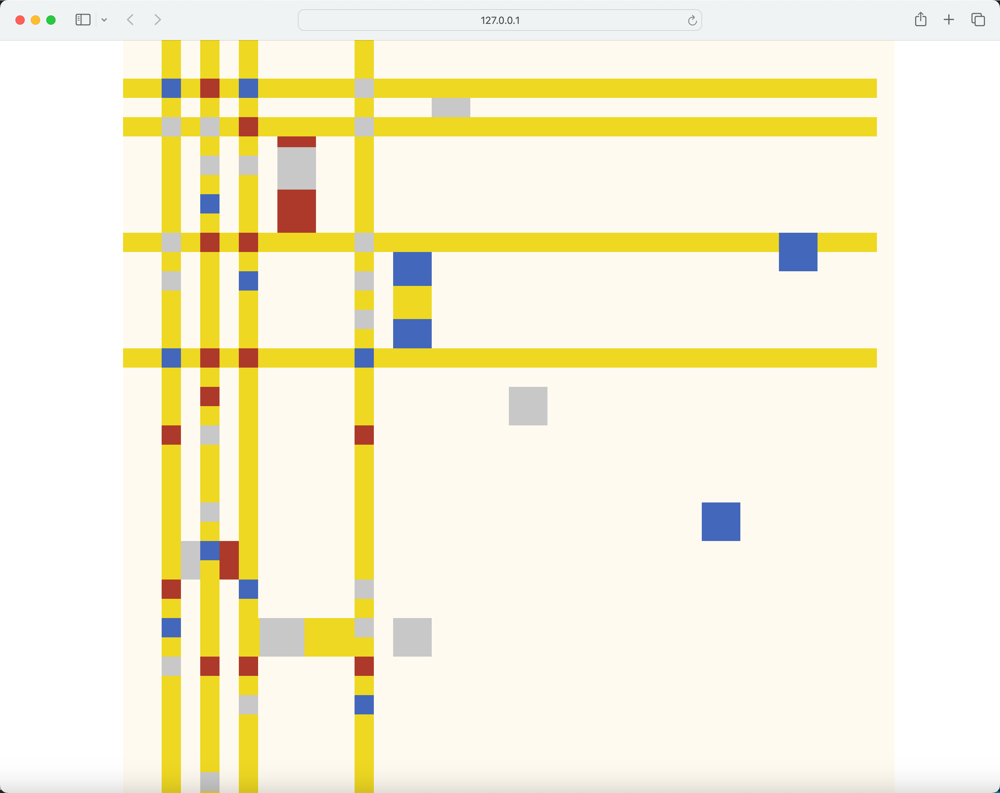
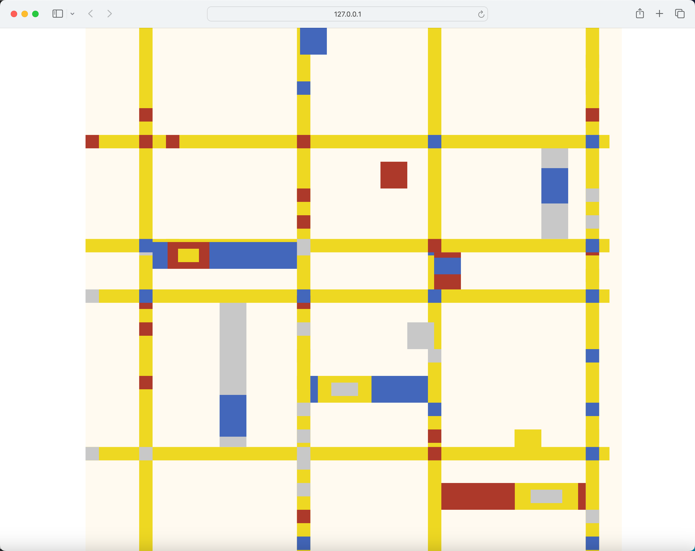

# shyu0865_9103_tut3_majorProject

## 1. How to interact with the work

I used two methods to make the code dynamic.
1. Time：
The refresh rate of the screen randomly changes over time.
2. mouseY：
Users can change the number of yellow lines in the horizontal and vertical directions by changing the vertical position of the mouse.

## 2. Code explanation

1. This is the method I chose to make the code dynamic: Time-Based:Employ timers and events for animation.
2. Animation Properties:
   - Screen Refresh: Set the initial frame rate as initialFrameRate, and adjust the frame rate gradually during each draw() function call using the formula for calculating easing progress, transitioning smoothly to a new random frame rate. Specifically, by calculating the difference between the current time and the start of the transition, dividing it by the transition time to get the easing progress coefficient t, and then applying t to calculate the current frame rate, achieving the effect of easing refresh.
   - Yellow Line Quantity: Use map() to map mouseY (ranging from 0 to the window height) to the quantity of yellow horizontal and vertical lines (ranging from 4 to 10).

3. Animation Inspiration: I saw animations based on Mondrian's artworks online, showing changes in lines. Therefore, I believed I could dynamically adjust the lines in my section.
   
4. Changes:
   - In addition to the added code sections mentioned above, a significant change was made to the logic for generating yellow lines in the group code. Since there was no requirement to adjust the quantity of yellow lines in the group code, the logic for generating yellow line positions was to first determine the x and y positions of the first horizontal or vertical yellow line, and then arrange the subsequent yellow lines at regular intervals. After adding the operation to reduce the number of yellow lines in my individual section, a problem with the group code became apparent: when the number of yellow lines is small, the yellow lines tend to cluster in the top left corner of the screen, as shown in the image below:
  
    However, if increasing the distance between the yellow lines fills the entire screen when the number of yellow lines is at its minimum, the effect of increasing the number of yellow lines becomes less apparent. Based on this, I adjusted the logic for the positioning of the yellow lines. First, I determined the x and y coordinates of the first yellow line. Then, through a loop, the number of yellow lines was determined based on the horizontalYellowLines and verticalYellowLines variables. Subsequently, the canvas width or height was subtracted from the x or y coordinate of the first yellow line, and the remaining space was divided by the number of yellow lines to evenly divide the screen. Finally, a yellow line was randomly generated within each space, ensuring that the yellow lines fill the entire screen. The effect is shown in the image below:
  
  - Another change is that I encapsulated Mondrian-related properties and methods from the group code into a separate class. In particular, I moved the calculateMondrian() function to the newly created class to associate it with the Mondrian object. 
5. Tools and technique from outside the course：
   - The map() function is used to map a value from one range to another and return the mapped value. I used the map() function to map mouseY to the number of yellow lines, dynamically adjusting the number of horizontal and vertical yellow lines based on the mouse's position along the y-axis.
   - [map function source](https://p5js.org/reference/#/p5/map)
   - The floor() function is used to round a number down to the nearest integer.
   - [floor function source](https://p5js.org/reference/#/p5/floor)